# Introduction

Due to the crucial impact of population density and interaction patterns
on the transmission of certain infectious diseases, we propose the
hypothesis that the changes in school absenteeism could serve as the
indicator of disease prevalence. For instance, (Sasaki et al., 2009) has
found that tracking disease-specific school absenteeism data can
effectively forecast the outbreaks of influenza in Japan, while
non-disease-specific school absenteeism data has shown limited
correlation with influenza activity in the US (Egger et al., 2012). In
this study, we analyze the non-disease-specific school absenteeism data
in Hong Kong spanning from 2008 to 2020 to evaluate its predictive
potential for influenza cases, including both type A and B strains.

# Problem Definition

## Target and Feature Variables

The dataset includes a target variable representing the occurrence of
flu across all subtypes. There are four categories of variables:

1\. Disease-related variables, such as Adenovirus, RSV, Influenza B,
Influenza H1, Influenza H3, Paraflu12, and Paraflu34, are not available
for time t+1. It's important to note that cumulative flu cases
(aggregated from Influenza B, Influenza H1, and Influenza H3) are used
as the target variable.

2\. Weather-related variables are known at time t+1 and include absolute
humidity, relative humidity, solar radiation, pressure, maximum
temperature, minimum temperature, mean temperature, temperature range,
total rainfall, and wind speed.

3\. Seasonal variables, such as year, month, and week of reported cases,
are known at time t+1. These values are transformed using a sinusoidal
function.

4\. The student school absence-related variable is also known at time
t+1.

## Stationarity and Seasonality of Disease-related Variables

Firstly, [Figure 1](#_Ref172807296) presents a visualization of all
observations relevant to diseases. Based on Augmented Dickey-Fuller
(ADF) tests performed for each variable, it is found that, except for
Adenovirus, the time series for other diseases are stationary.

<figure>
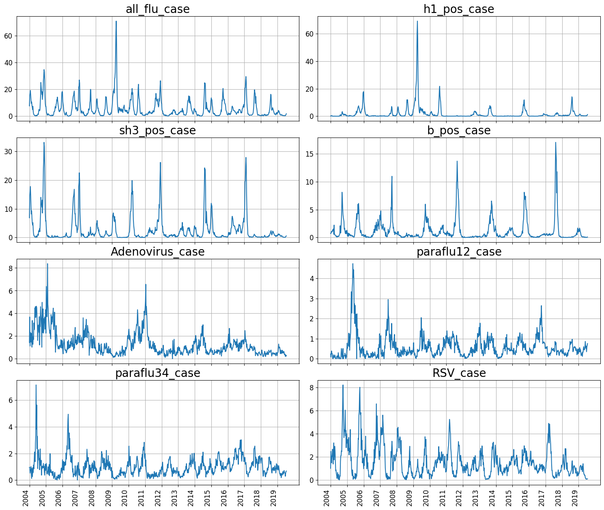
<figcaption>
Figure 1.
Line chart of reported cases for each disease from 2004 to
2020.
</figcaption>
</figure>

Since cyclical patterns are observed in [Figure 1](#_Ref172807296),
spectral analyses are conducted to capture dominant frequencies for each
disease variable as in [Figure 2](#_Ref172826620). Currently, two
sinusoidal functions (sin and cos) are used to encode the seasonality
factors. In the future, Harmonic regression may be used to capture more
complicated seasonality dynamics.

<figure>
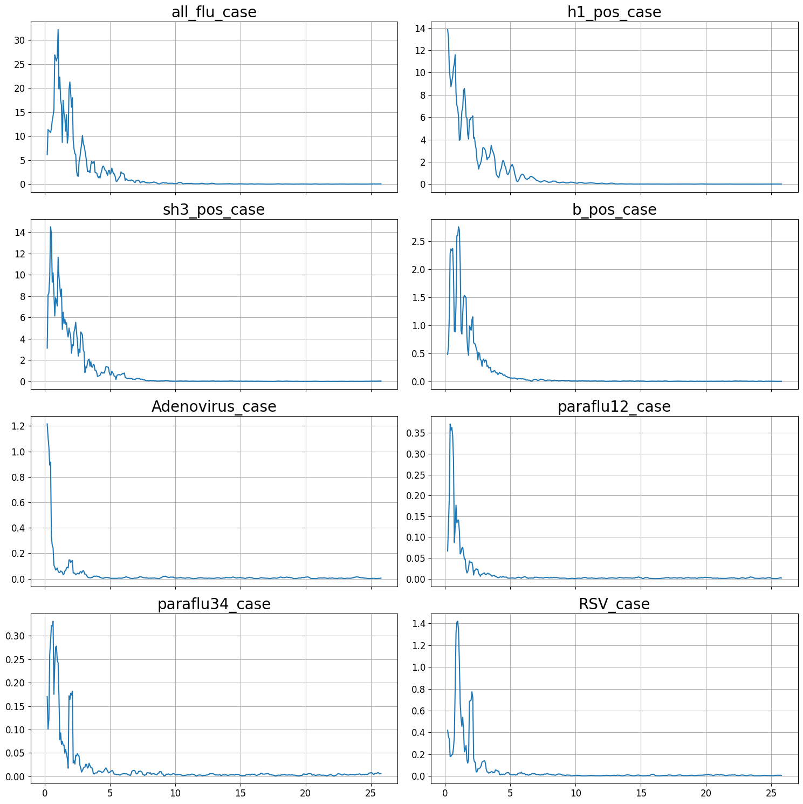
<figcaption>
Figure 2.
Spectral analysis for each disease variable.
</figcaption>
</figure>

## 

## School Absence Data

[Figure 3](#_Ref172807686)a is the distribution illustrated as a
histogram for school absence data. Important metrics for its
distribution are in [Table 1](#_Ref172826689). Because the school
absence data has 40% missing, an appropriate approach needs to be
employed to filling these missing data. We can observe the pattern of
the missing data as in [Figure 4](#_Ref172808060)a. Since there is a
clustered missing data from year 2004 to 2008, this part of observations
is removed when the school absence data is used as a feature. The
missing pattern after removing this part of observations is shown in
[Figure 4](#_Ref172808060)b. [Figure 4](#_Ref172808060)a shows the
histogram of school absence data before filling missing data, while
[Figure 4](#_Ref172808060)b shows the histogram after the missing data
has been filled by 95% percentile.

| Metrics | Mean | Median | Min  | 25%  | 75%  | 95%   | Max   | Missing% |
|---------|------|--------|------|------|------|-------|-------|----------|
|         | 4.13 | 4.10   | 1.20 | 2.60 | 5.20 | 7.085 | 11.00 | 40.17    |

Table 1. Descriptive
statistical metrics for the 2004-2020 School absenteeism data.

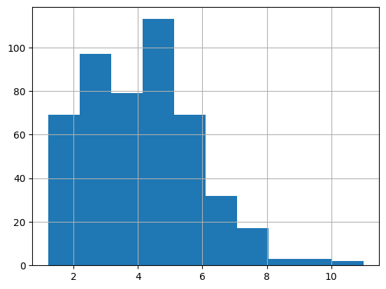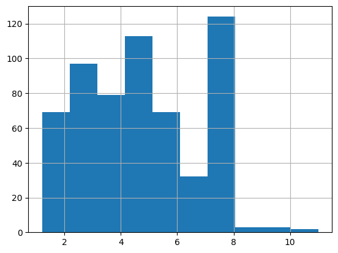

Figure 3. School
Absenteeism data distribution (a) before and (b)after filling in the
missing data.

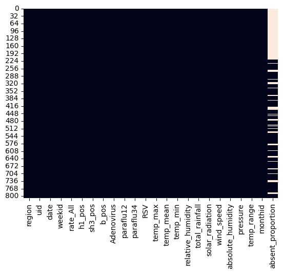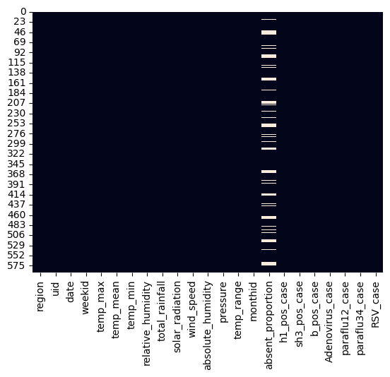

Figure 4.(a) Pattern of
absence missing data from 2004,(b) Pattern of absence missing data from
2008.

# Methods

## Baseline Models

Because of the unique seasonality observed in disease cases, it is
reasonable to use historical values as a baseline model for predictions,
even for forecasting periods up to eight weeks ([Figure
5](#_Ref172608468)a), especially for shorter-term predictions ([Figure
5](#_Ref172608468)b). More specifically, the baseline model predicts the
values of the target variable at times t+1 to t+h using the values of
the target variable at time t. Baseline models serve as benchmark to
evaluate the performance of subsequent, more complicated models.

## Random Forest

The Random Forest model is chosen due to its resilience to outliers and
its ability to provide insight into feature importance. However, as it's
not inherently designed for time series modeling, historical information
is integrated into the feature space by including lagged variables for
each feature. In the constructed Random Forest model, for every original
predictor, its lagged observations up to 8 weeks prior are included as
input variables. This expands the total predictor dimension to 144 if
school absence data is not considered, and to 152 if school absence data
is included.

The important hyper-parameters that have been tuned for the Random
Forest models are:

- n_estimators =\[20,40,80\]: number of decision trees used in the
  Random Forest

- max_features=\[10,20,40\]: number of subset features used when
  considering the best split

- max_depth=\[4,8,16\]: The maximum depth of the tree

- min_samples_split=\[8,16\]: The minimum number of samples required to
  split an internal node

- min_samples_leaf=\[4,8\]: The minimum number of samples required to be
  at a leaf node

- criterion={“squared_error”, “absolute_error”, “friedman_mse”}: the
  function to measure the quality of a split.

- bootstrap ={True, False}: Whether bootstrap samples are used when
  building trees. If False, the whole dataset is used to build each
  tree.

- train_start_fix = {0,1}: 0 means that the start of training data is
  t-N when making predictions for observations starting at t. 1 means
  that the start of training data is always from t=0.

## GRU or LSTM

Because GRU lacks a dedicated memory unit and only features two gates
(reset and update), while LSTM includes three gates (input, output, and
forget), LSTM typically excels in capturing long-term information
whereas GRU is more adept at identifying short-term changes.
Consequently, a framework comprising two layers of LSTM/GRU is developed
with the goal of enhancing the accuracy of time series forecasting
(Refer to [Figure 5](#_Ref172808660)).

<figure>
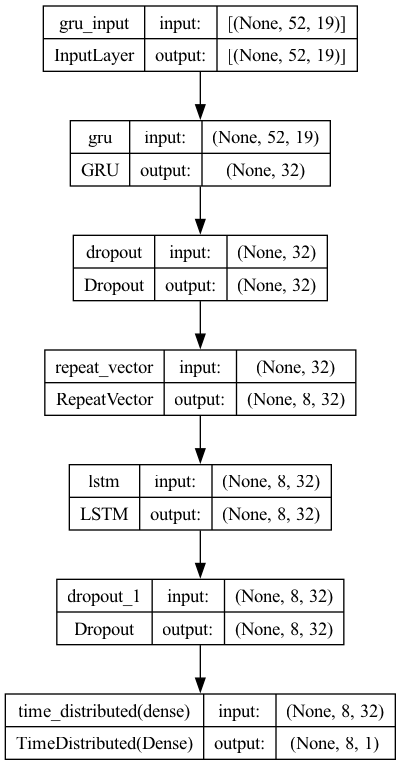
<figcaption>
. The LSTM neural network structure.
</figcaption>
</figure>

Due to the adaptable nature of the Keras deep learning module, there's
room to investigate custom sample weights and loss functions to discover
optimal combinations. The key hyperparameters of this framework include:

- first layer and second layer modules: either LSTM or GRU

- customized sample weights: three approaches are used to mitigate the
  low occurrence of extreme value observations: (1) divide the data
  samples into bins,(2) take power operation , and (3) take exponential
  operation

- learning rate ranges from 1e-3 to 1e-2

- number of neurons in each layer is either 16 or 32

- dropout rate is either 0.2 or 0.3

After hyper-parameter tuning, it is found that the optimal configuration
consists of a GRU layer as the first layer followed by an LSTM layer,
binning the data samples, utilizing a learning rate of 1e-2, and
employing a dropout rate of 0.3.

## TFT

Temporal Fusion Transformer (TFT), proposed by (Lim et al., 2019), aims
to improve the interpretability of multi-horizon and multivariate time
series forecasting. It's an attention-based model that evaluates the
influence of each covariate at every lag.

Its predictors are divided into three groups:

- Static variables: These are variables that remain constant over time,
  such as the region where the disease case is reported.

- Time-varying known variables: These are variables that change over
  time but are already known at the time of forecasting, such as
  temperature or wind speed.

- Time-varying unknown variables: These are variables that change over
  time and are unknown at the time of forecasting, such as newly added
  cases of other diseases for the forecasting horizon.

The three categories of predictors mentioned above are put into a
variable selection module. Then, the static variables are directed into
static covariate encoders, the time-varying unknown variables are
channeled into LSTM encoders, and the time-varying known variables are
sent into LSTM decoders. Following another GRU operation, all these
transformed predictors are combined within a multi-head attention
framework. Subsequently, after another GRU operation, the final dense
layer produces the ultimate output.

In the implementation of TFT, seasonal and weather-related variables are
treated as time-varying known variables, and all the disease-related
variables are treated as time-varying unknown variables.

The hyper-parameters of the TFT framework include:

- gradient_clip_val: is set to a value between 0.1 to 10 to avoid
  exploding gradients

- hidden_size: hidden size of network which is its main hyperparameter
  and can range from 8 to 512

- dropout: is set to between 0.2 to 0.3

- hidden_continuous_size: default for hidden size for processing
  continuous variables (similar to categorical embedding size)

- attention_head_size: number of attention heads (4 is a good default)

- learning_rate: is set to between 1e-4 to 1e-2

# Results

Metrics used to evaluate the forecasting performance of the models
include:

- MAE: Mean Absolute Error

- RMSE: Root Mean Squared Error

- SMAPE: Symmetric Mean Absolute Percentage Error

- NNSE: The Nash–Sutcliffe efficiency is calculated as one minus the
  ratio of the error variance of the modeled time-series divided by the
  variance of the observed time-series

- IS: Interval scores, which evaluate the prediction intervals and equal
  the width of the prediction interval plus penalties for being outside
  the interval

[Table 2](#_Ref172804093) summarizes the performance of various methods
as a ratio relative to the metric of the baseline model, considering
both scenarios with and without school absenteeism data. [Table
3](#_Ref172608530) reports the MAE between ground truth and predictions
over the years from 2013 to 2018 across methods considering school
absenteeism. The prediction horizons are all 8 weeks across methods.

| Methods\Metrics                           | MAE    | RMSE   | SMAPE  | 1 - NNSE |
|-------------------------------------------|--------|--------|--------|----------|
| Baseline                                  | 1.00   | 1.00   | 1.00   | 1.00     |
| Random Forest (no absence, lookback 8w)   | 0.7939 | 0.7889 | 0.8755 | 0.7558   |
| Random Forest (with absence, lookback 8w) | 0.7883 | 0.8014 | 0.9064 | 0.7715   |
| LSTM (no absence, lookback 8w)            | 0.8091 | 0.8485 | 0.8835 | 0.8122   |
| LSTM (with absence, lookback 8w)          | 0.8216 | 0.7975 | 0.9375 | 0.7595   |
| TFT (no absence, lookback 8w)             | 1.0322 | 0.9975 | 1.1865 | 0.9925   |
| TFT (with absence, lookback 8w)           | 0.8772 | 0.8853 | 1.0612 | 0.8621   |

Table 2. Compare the
performances of various methods as a ratio relative to the baseline\
metric, considering both scenarios with and without school absence data.

| Year/Methods | Baseline | Random Forest | LSTM          | TFT    |
|--------------|----------|---------------|---------------|--------|
| 2013         | 2.5066   | 2.3700        | 2.2910/2.6130 | 2.8098 |
| 2014         | 4.5384   | 3.1700        | 3.1400/3.1700 | 3.8825 |
| 2015         | 2.8598   | 1.7820        | 2.1400/1.9750 | 2.3777 |
| 2016         | 4.3118   | 2.7730        | 5.5800/4.7900 | 4.7860 |
| 2017         | 2.5931   | 1.7710        | 2.5310/1.6490 | 2.2438 |
| 2018         | 2.1496   | 1.6920        | 1.6650/1.8820 | 1.2876 |

Table 3. MAE between
ground truth and predictions over the years from 2013 to 2018 across
methods considering school absenteeism. The prediction horizons are all
8 weeks across methods.

## Baseline Models

[Figure 6](#_Ref172608468) visually compares the prediction of influenza
cases with their ground truth using baseline models under different
forest horizons (two weeks and eight weeks). It can be concluded that,
in the baseline models, a longer forecast horizon lead to a broader lag
between the prediction and ground truth.

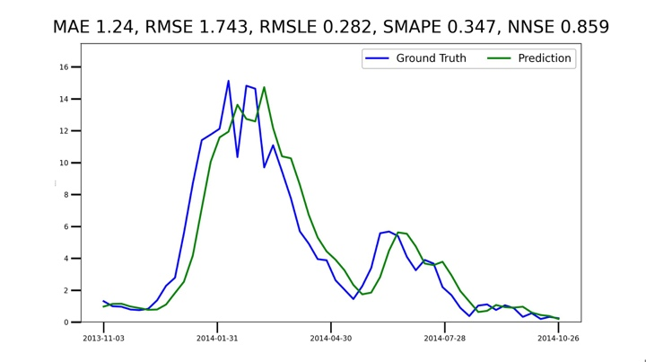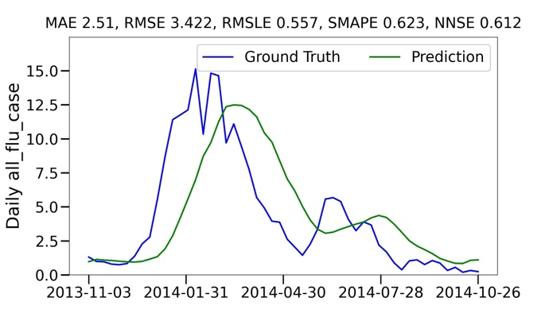

\(a\) forecast horizon h= two weeks (b) forecast horizon h= eight weeks

Figure 6.Visualizations
and statistical metrics to compare predictions of flu cases with their
ground truth using baseline models under different forecast horizons.

## Random Forest

Random Forest is chosen because of its resilience to overfitting and its
capability of obtaining non-linear relationship between input features
and targets. We start from using a lookback horizon of 8 weeks and
incorporating the school absenteeism data into the feature space.
[Figure 7](#_Ref172609049) shows that Random Forest outperforms the
baseline model by 27% in terms of MAE.

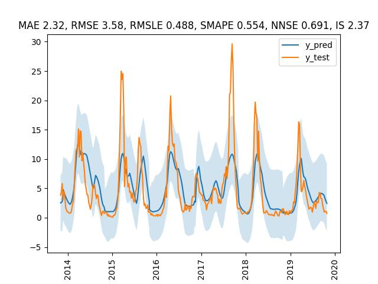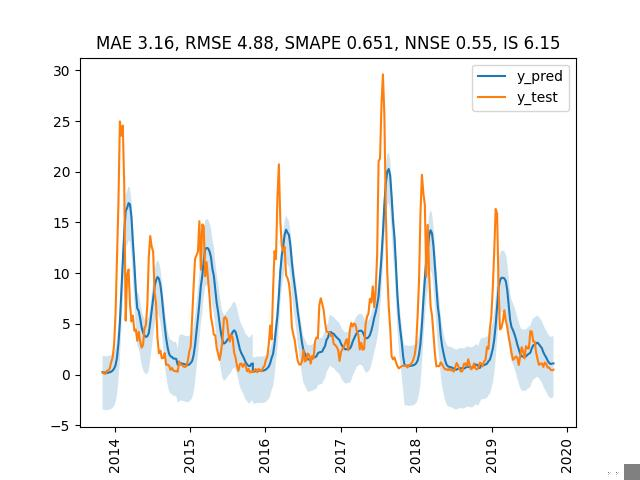

> \(a\) (b)

Figure 7. Visualizations
and statistical metrics to compare predictions of flu cases with their
ground truth using Random Forest with a prediction horizon of 8 week.
Orange line: ground truth, blue line: predictions, light blue shade:
quantile predictions based on training residuals. (a) Random Forest, (b)
Baseline Model.

[Figure 8](#_Ref172608543) is a visualization comparison between the
baseline model and random forest model for the prediction of year
2013-2014 influenza disease cases. It shows that there is a smaller
number of lags between the predicted values using random forest and the
ground truth.

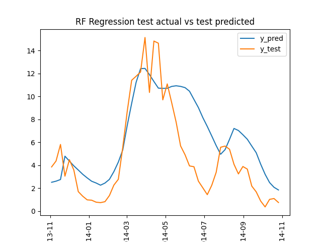

Figure 8. Visualizations
and statistical metrics to compare predictions of flu cases with their
ground truth using baseline model and Random Forest. The prediction
horizons are all 8 weeks for both methods.

We can also conclude from [Table 3](#_Ref172608530) that random forest
has superior prediction accuracy comparing with other methods including
the baseline model both across all years between 2013 and 2018 and in
any particular year even when the forecast horizon is 8 weeks.

We have also calculated the impurity-based feature importance ([Figure
9](#_Ref172791603)) using the same model configuration with lookback
period of 8 weeks. Several observations can be drawn from [Figure
9](#_Ref172791603):

1)  The importance of school absenteeism data ranks 11th out
    of 25 variables on average

2)  The importance of lagged target variable is significantly greater
    than that of the absenteeism data

3)  The importance peaked at a lag of 8 weeks for both the lagged target
    variable and absenteeism data

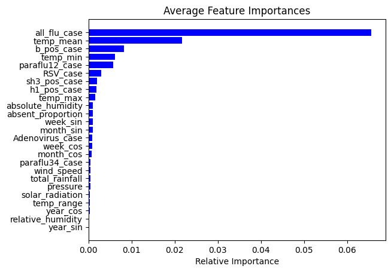

\(a\)

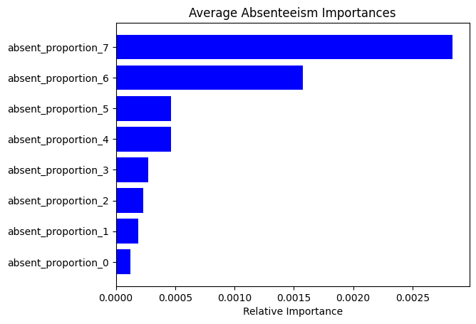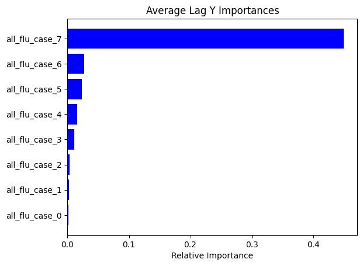

\(b\) (c)

Figure 9. Impurity-based
feature importance of (a) all features, (b)school absenteeism data,
and(c) lagged target variables (all influenza cases) when lookback
horizon is 8 weeks.

Because of the above observations, we would like to conduct two further
experiments: (1)predict the influenza activity without the absenteeism
data and monitor its performance, and (2)expand the look-back horizon to
12 and 16 weeks to see whether the feature importance for both will
still peak at 8th week.

Firstly, by expanding the look-back horizon to 12 and 16 weeks, [Table
4](#_Ref172791768) shows that the prediction performance with
absenteeism data is marginally better than the prediction without
absenteeism data across all lookback horizons vary from 8 weeks to 16
weeks.

| MAE | Lookback 8w | Lookback 12w | Lookback 16w | Lookback 16 w Prescreen |
|----|----|----|----|----|
| With absenteeism | 2.32 | 2.41 | 2.56 | 2.74 |
| Without absenteeism | 2.34 | 2.43 | 2.58 | 2.77 |

Table 4. Compare
accuracies with and without absenteeism data across various model
configurations, including lookback horizon and pre-screening of
features.

Secondly, we compare the feature importance ranking of the school
absenteeism data when the look-back windows are expanded to 12 and 16
weeks. [Figure 10](#_Ref172793551) shows that when the lookback horizon
is 12 weeks, the feature importance ranking of the school absenteeism
data decreases from 11th to 14th, and it further
decreases to 16th when the lookback horizon is 16 weeks.

> 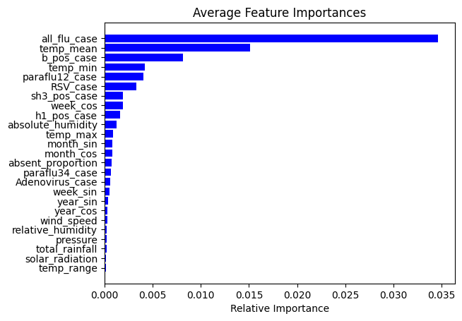 style="width:4.54167in;height:3.15278in" />
>
> \(a\)
>
> 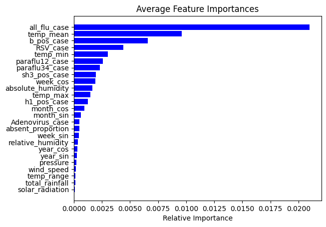 style="width:4.52778in;height:3.15278in" />
>
> \(b\)

Figure 10.Impurity-based
feature importance of all features when lookback horizon is (a)12 weeks,
(b) 16 weeks.

Under the random forest model, if there is no pre-screening of features,
from [Figure 9](#_Ref172791603),[Figure 11](#_Ref172803339), it seems
like the longer the lagged school absenteeism data, the greater the
feature importance according to impurity decrease.

> 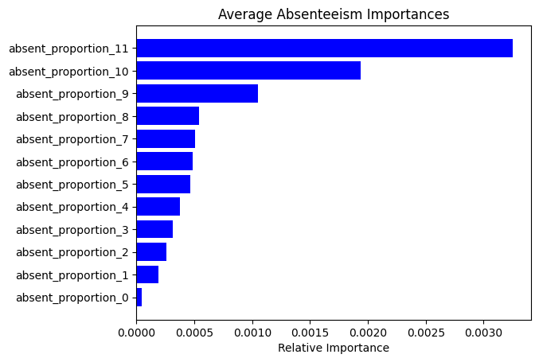 style="width:2.97244in;height:1.99628in" />
> 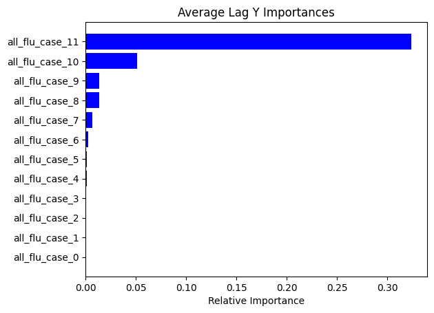 style="width:2.80286in;height:2.01984in" />
>
> \(a\) (b)

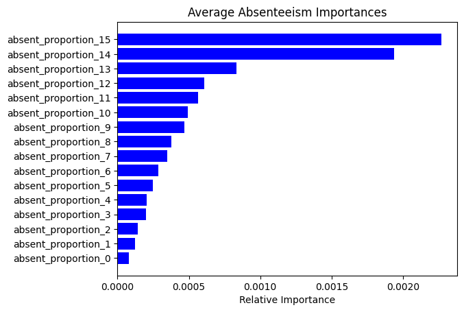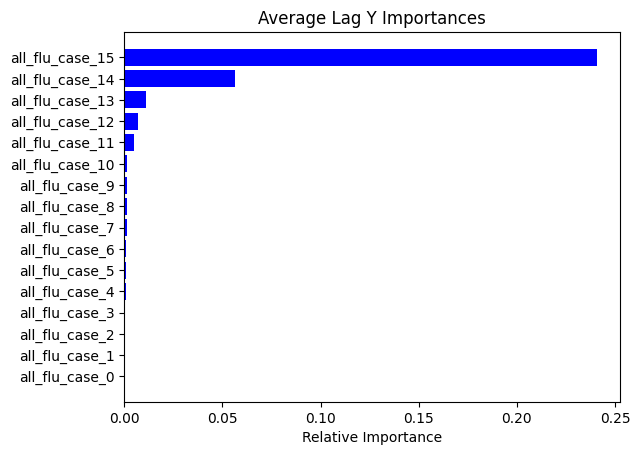

> \(c\) (d)

Figure 11. The
impurity-based feature importance of each lagged absenteeism variable
and target variable. (a) feature importance for absenteeism variables
with look-back horizon of 12 weeks, (b) feature importance for lagged
target variables with look-back horizon of 12 weeks, (c) feature
importance for absenteeism variables with look-back horizon of 16 weeks,
(d) feature importance for lagged target variables with look-back
horizon of 16 weeks

However, this is not the case when a pre-screening is applied before
training the model. Besides the limitation of impurity-based feature
importance calculation, including a bias toward high cardinality
features and ignoring the data shift between the training and test data,
another two potential contributing factors are overfitting and
multi-collinearity when no pre-screening of the features is conducted.
If pre-screening is applied, in general, the school absenteeism lagged
at least 10 weeks have better feature importance than the remaining ones
(See [Figure 12](#_Ref172803576)).

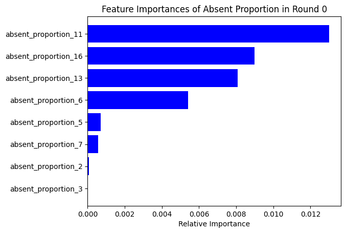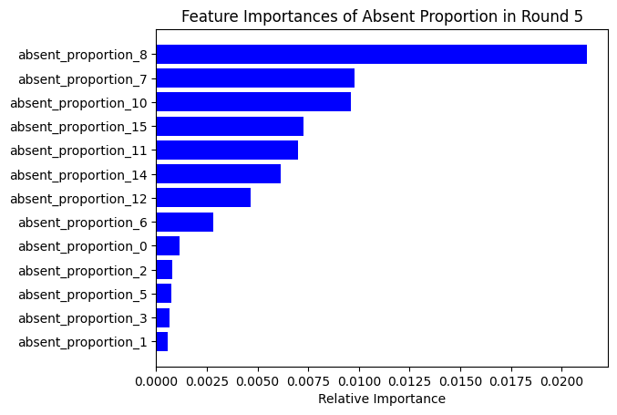

> \(a\) (b)

Figure 12. The
impurity-based feature importance of lagged absenteeism variables after
pre-screening by Pearson Correlation with a lookback horizon of 16
weeks. (a) feature importance for absenteeism variables in years
2009-2013, (b) feature importance for absenteeism variables in years
2009-2018.

Although random forest is the framework that has achieved the best
overall prediction performance according to [Table 2](#_Ref172804093).
However, [Figure 7](#_Ref172609049) reveals that the point predictions
for extreme levels of disease cases are all smaller than 15. There are
two potential contributing factors:

1)  The importance of the lagged observations of the target variable
    (all_flu_case) is disproportionally larger than all other factors.
    Since random forest build trees by arbitrarily excluding variables
    at nodes, the trees with most nodes excluding this dominating
    feature will have seriously biased prediction for these disease
    cases with extreme levels. After averaging over all trees, the
    predictions for these extreme observations will converge to an
    average level.

2)  Random forest regression has difficulty extrapolating at levels
    outside the training data

To mitigate the disparity between the predicted values and ground truth
for the extreme cases, the following treatments have been explored:

1)  Log Transformation

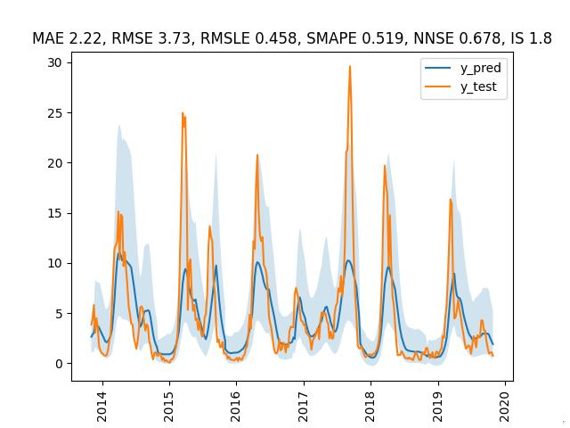

(a)No transformation (b)Log transformation

Figure 13. Visualizations
and statistical metrics to compare predictions of flu cases with their
ground truth using Random Forest with a prediction horizon of 8 week.
Orange line: ground truth, blue line: predictions, light blue shade:
quantile predictions based on training residuals. (a) No transformation,
(b) Log transformation.

[Figure 13](#_Ref172804344) reveals that Log transformation is able to
improve the overall prediction performance from 2.32 to 2.22 in terms of
MAE. However, it fails to significantly improve the prediction for
extreme level data points.

2)  Log-diff Transformation

[Figure 14](#_Ref172804461) reveals that Log-diff transformation is able
to relax the predictions at the extreme level datapoints to a broader
range. However, since it introduces a larger variance to the target
variables, the overall prediction performance significantly
deteriorated.

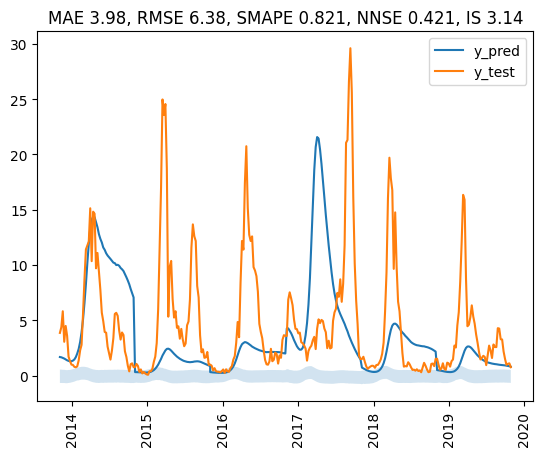

(a)No transformation (b)Log-diff transformation

Figure 14. Visualizations
and statistical metrics to compare predictions of flu cases with their
ground truth using Random Forest with a prediction horizon of 8 week.
Orange line: ground truth, blue line: predictions, light blue shade:
quantile predictions based on training residuals. (a) No transformation,
(b) Log-diff transformation.

## GRU and LSTM

When using a look-back horizon of 8 weeks, LSTM was able to outperform
the baseline model by around 20% (see [Table 2](#_Ref172804093)) and is
the 2nd best framework in terms of the overall MAE. Compared
with Random Forest, LSTM is better at capturing the extreme levels of
the target variable, which is more obvious when the loo-back horizon is
shorter, say 2 weeks. Under this scenario, LSTM achieves the best MAE of
1.56, surpassing that of the random forest at an MAE of 1.62 (see
[Figure 15](#_Ref172805393)).

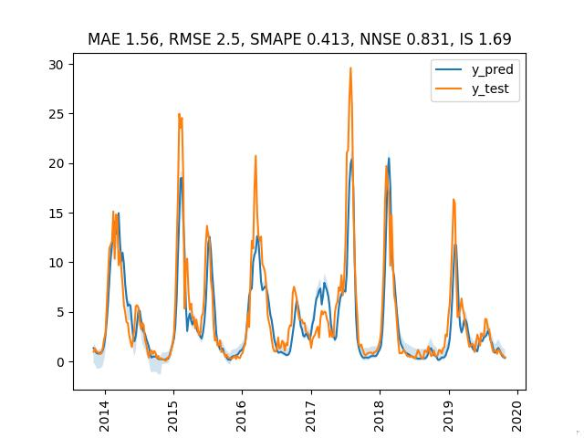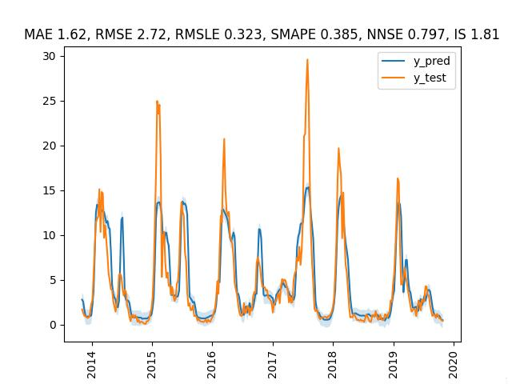

Figure 15. Visualizations
and statistical metrics to compare predictions of flu cases with their
ground truth using LSTM Random Forest with a prediction horizon of 2
week. Orange line: ground truth, blue line: predictions, light blue
shade: quantile predictions based on training residuals. (a) LSTM, (b)
Random Forest.

Firstly, we are evaluating the impact of the school absenteeism data on
prediction accuracy under the LSTM framework using various look-back
horizons. [Table 5](#_Ref172805614) shows that the prediction accuracy
when including the school absenteeism data in the feature space is in
general better than the opposite scenario. Only when the lookback
horizons are either 8 weeks or 16 weeks, there is almost no difference
in the prediction accuracy between the two scenarios.

| MAE | Lookback 8 | Lookback 16 | Lookback 52 | Lookback 8 with extra dense layer | Lookback 16 with extra dense layer | Lookback 52 with extra dense layer |
|----|----|----|----|----|----|----|
| With absenteeism | 2.94 | 3.37 | 2.71 | 2.85 | 2.92 | 2.75 |
| Without absenteeism | 2.93 | 3.36 | 2.83 | 2.87 | 3.07 | 2.86 |

Table 5. Compare
accuracies with and without absenteeism data across various model
configurations, including lookback horizon and extra dense layer before
the final layer.

Secondly, the permutation-based feature importance is calculated as the
added MAE when randomly shuffle the data along the dimension of a
specific feature. [Figure 16](#_Ref172806029) shows that the importance
of absent_proportion ranks 7th among all features when the
lookback horizon is 8 weeks, and it deceases to 14th when the
lookback horizon becomes 52 weeks.

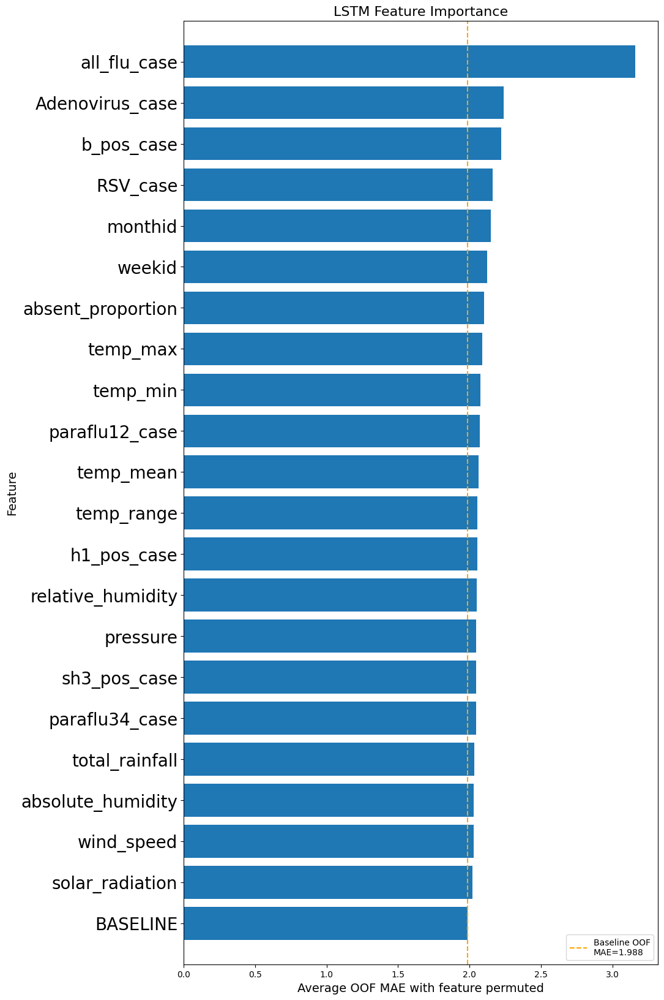
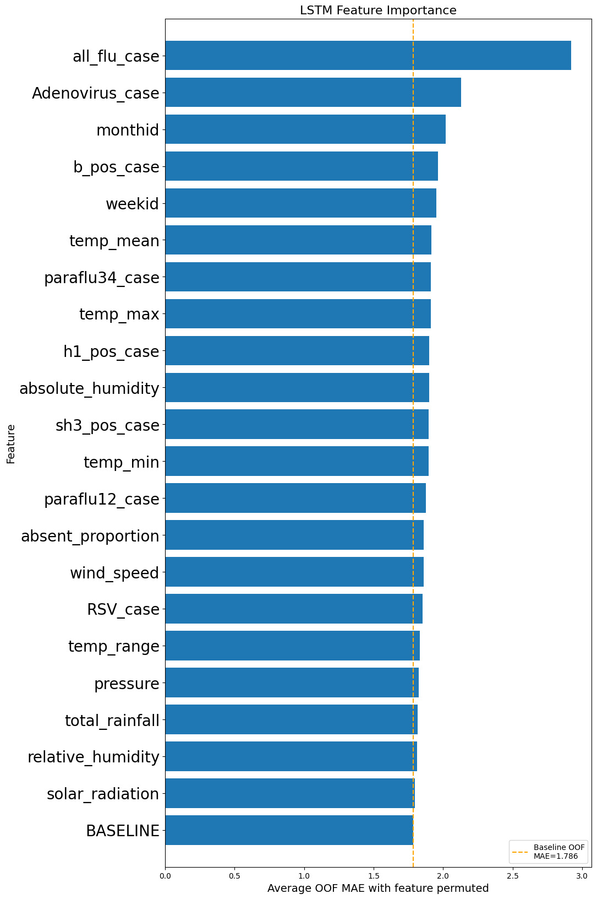

\(a\) Lookback 8w with extra dense layer (b) Lookback 52w with extra
dense layer

. Feature importance of school absenteeism data through permutation
importance. (a) with a look-back horizon of 8 weeks, (b) with a
look-back horizon of 52 weeks.

## Temporal Fusion Transformer (TFT)

[Figure 17](#_Ref172806318) shows that although random forest has better
overall prediction accuracy than TFT in terms of MAE, TFT achieves
better uncertainty measured interval score (TFT has an interval score of
1.18 while random forest’s interval score is 2.37). [Table
2](#_Ref172804093) also shows that the prediction accuracy when
including the school absenteeism data in the feature space is better
than the opposite scenario by 16%. The feature significance of school
absenteeism data ranked 2nd to last both as an encoder
variable and a decoder variable (see [Figure 18](#_Ref172806614)).

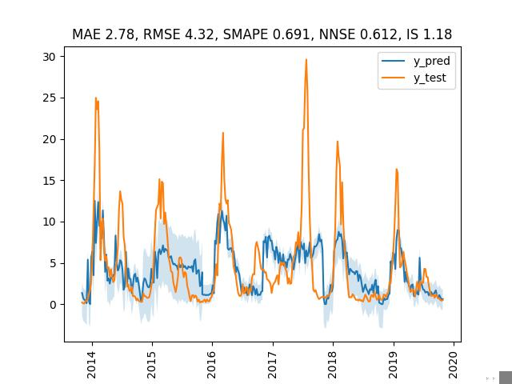

Figure 17. Visualizations
and statistical metrics to compare predictions of flu cases with their
ground truth using TFT and Random Forest with a prediction horizon of 8
week. Orange line: ground truth, blue line: predictions, light blue
shade: quantile predictions based on training residuals. (a) TFT, (b)
Random Forest.

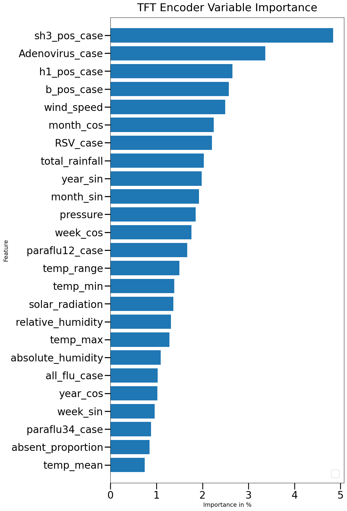
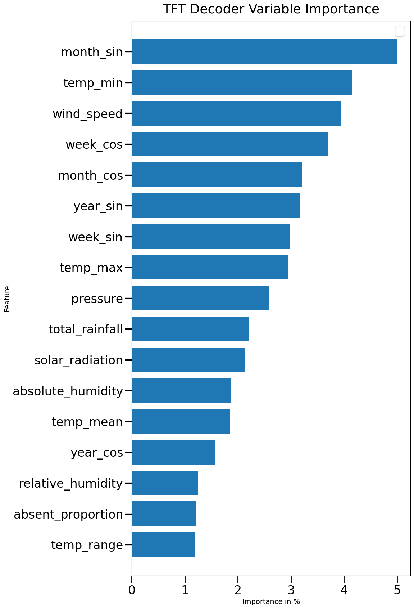

(a)Feature importance of encoder variables (b)Feature importance of
decoder variables

Figure 18. Feature
importance of both encoder and decoder variables when the look-back
horizon is 8 weeks.

## More comparison under different forecast horizons

[Figure 19](#_Ref172829073) illustrate the predictions of influenza
cases under different forecast horizons when the lookback horizon is 8
weeks. We can see the LSTM framework is better at capturing the extreme
data points patterns.

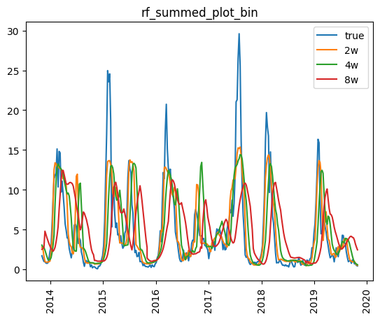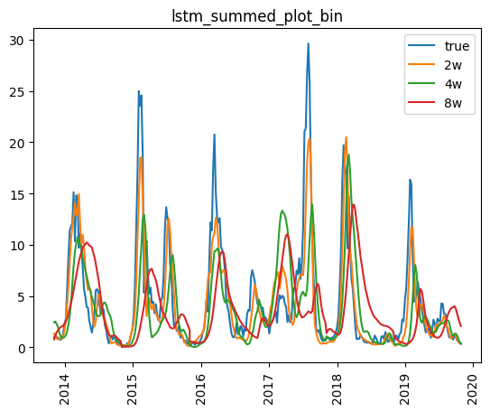

> \(a\) (b)

Figure 19. Influenza
prevalence predictions from 2014 to 2019 under forecast horizons of 2
weeks, 4 weeks and 8 weeks. (a)using Random Forest framework, (b) using
LSTM framework.

# Conclusion

Including school absenteeism data can enhance accuracy in predicting
influenza prevalence. Random Forest generally excels in forecasting
disease cases with limited data availability. LSTM performs better than
Random Forest with a two-week lookback horizon, especially in scenarios
involving extreme data points. TFT shows promise with improved data
availability but necessitates additional hyperparameter tuning. School
absenteeism data holds higher feature importance with shorter lookback
periods. In Random Forest models, school absenteeism data at longer lags
exhibits greater feature importance. Determining the optimal lags for
school absenteeism data in LSTM and TFT frameworks requires further
exploration.

# References

Egger, J. R., Hoen, A. G., Brownstein, J. S., Buckeridge, D. L., &
Konty, K. J. (2012). Usefulness of School Absenteeism Data for
Predicting Influenza Outbreaks, United States. *Emerg. Infect. Dis.*,
*18*(8), 1375–1377. https://doi.org/10.3201/eid1808.111538

Lim, B., Arik, S. O., Loeff, N., & Pfister, T. (2019). Temporal Fusion
Transformers for Interpretable Multi-horizon Time Series Forecasting.
*ArXiv*. https://doi.org/10.48550/arXiv.1912.09363

Sasaki, A., Hoen, A. G., Ozonoff, A., Suzuki, H., Tanabe, N., Seki, N.,
Saito, R., & Brownstein, J. S. (2009). Evidence-based Tool for
Triggering School Closures during Influenza Outbreaks, Japan. *Emerg.
Infect. Dis.*, *15*(11), 1841. https://doi.org/10.3201/eid1511.090798

 
